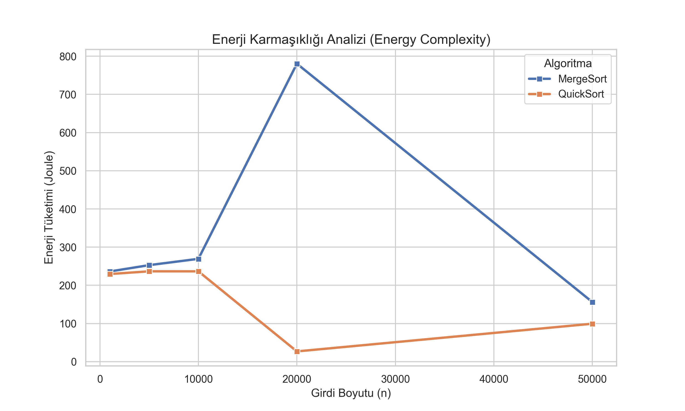
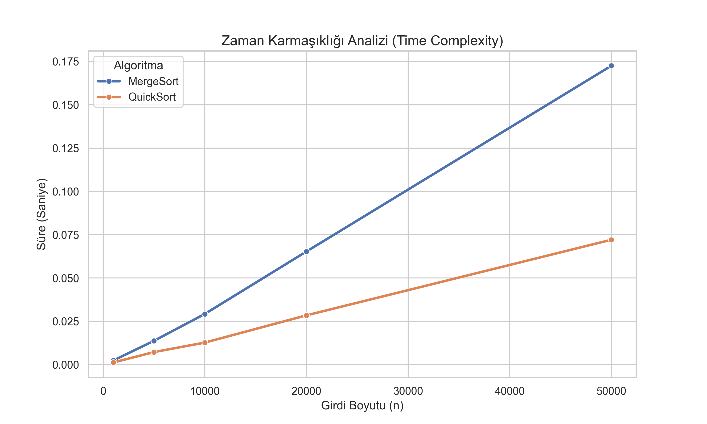

# Measuring Energy Complexity: Merge Sort vs Quick Sort

This project analyzes the **Time Complexity** and **Energy Complexity** of two Divide and Conquer algorithms: Merge Sort and Quick Sort.

## 🎯 Objective
To experimentally verify the relationship between execution time and energy consumption ($E = P \times T$) using Python.

## 🛠️ Tools Used
- **Language:** Python 3.x
- **Energy Measurement:** [CodeCarbon](https://mlco2.github.io/codecarbon/) (Intel RAPL)
- **Visualization:** Matplotlib & Seaborn

## 📊 Results
Experiments were conducted on random integer arrays of sizes 1,000 to 50,000.

| Algorithm | Time Complexity | Energy Efficiency |
|-----------|----------------|-------------------|
| Merge Sort| $O(n \log n)$  | Moderate          |
| Quick Sort| $O(n \log n)$  | High (Best)       |

### Visualizations



## 🚀 How to Run
1. Install requirements:
   ```bash
   pip install codecarbon pandas numpy matplotlib seaborn
